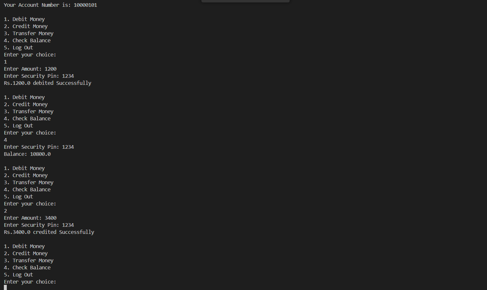

# Java Console Banking System

A simple console-based banking system developed in Java using JDBC and MySQL. This project allows users to register, log in, and perform basic banking operations like debit, credit, balance check, and fund transfer.

## 🏦 Features

- User Registration & Login
- Account Creation with Initial Balance
- Secure Transactions using Security PIN
- Debit and Credit Money
- Balance Inquiry
- Fund Transfer (with error handling)
- Session Logout

## 🛠️ Technologies Used

- Java 21
- MySQL
- JDBC API
- VS Code / Terminal

## 🚀 Getting Started

### Prerequisites

- Java JDK 21+
- MySQL Server
- MySQL JDBC Driver
- IDE or text editor (e.g., VS Code, IntelliJ)

### Setup

1. **Clone the Repository**
   ```bash
   git clone https://github.com/yourusername/banking_system.git
   cd banking_system
   ```

2. **Configure MySQL Database**
   ```sql
   CREATE DATABASE banking_system;

   -- Create `users` and `accounts` tables accordingly
   ```

3. **Edit Database Credentials**
   ```java
   private static final String url = "jdbc:mysql://localhost:3306/banking_system";
   private static final String username = "root";
   private static final String password = "your_mysql_password";
   ```

4. **Compile and Run**
   ```bash
   javac -d . *.java
   java Projects_java.Banking_System.BankingApp
   ```

## 📸 Demo Screenshots

### 1. Registration and Login


### 2. Banking Operations(Debit, Credit & Balance)


### 3. Fund Transfer Attempt


### 4. MySQL Database 


## 📈 Skills Gained

- Core Java Programming (OOPs, Exception Handling, Loops, etc.)
- Working with JDBC for database operations
- MySQL database design and SQL query writing
- Console-based UI development and user interaction
- Modular design and code organization using classes
- Basic transaction handling and logic implementation
- Debugging and testing of Java applications
- Understanding of secure input (e.g., PIN verification)

## ⚠️ Security Notes

- Passwords and security PINs are stored in plaintext (for demo purposes). Encrypt these for production use.
- Ensure MySQL is securely configured in your system.

## 🚧 TODO

- Encrypt user credentials
- Add admin functionality
- Improve exception handling
- GUI implementation (Swing or JavaFX)